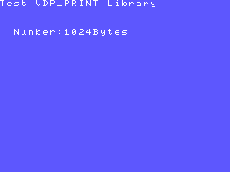
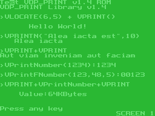
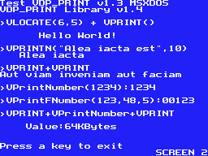

# VDP PRINT MSX SDCC Library (fR3eL Project)

<table>
<tr><td>Name</td><td>VDP_PRINT</td></tr>
<tr><td>Architecture</td><td>MSX</td></tr>
<tr><td>Environment</td><td>ROM, MSX BASIC or MSX-DOS</td></tr>
<tr><td>Format</td><td>C Object (SDCC .rel)</td></tr>
<tr><td>Programming language</td><td>C and Z80 assembler</td></tr>
<tr><td>Compiler</td><td>SDCC v4.4 or newer</td></tr>
</table>

---

## Description

Functions for display text strings in the graphic modes (Graphic1 and Graphic2) of the TMS9918A.

It is designed to work in GRAPHIC 2 mode (Screen 2), although it works in GRAPHIC 1 mode (Screen 1).

You can use this library to develop applications for ROM, MSXBASIC or MSX-DOS environments, using the Small Device C Compiler [(SDCC)](http://sdcc.sourceforge.net/) cross compiler.

Requires the `VDP_TMS9918A` Library to write to the VRAM and so that you can start the graphics modes.
- for ROM and MSX BASIC [VDP_TMS9918A_MSXBIOS](https://github.com/mvac7/fR3eL_VDP_TMS9918A_MSXBIOS_Lib) Library.
- for all environments [VDP_TMS9918A](https://github.com/mvac7/SDCC_TMS9918A_Lib) Library.

You can access the documentation here with [`How to use the library`](docs/HOWTO.md).

These libraries are part of the [MSX fR3eL Project](https://github.com/mvac7/SDCC_MSX_fR3eL).

This project is open source under the [MIT license](LICENSE).
You can add part or all of this code in your application development or include it in other libraries/engines.

Enjoy it!

 

| Note: |
| :---  |
| The function to convert a 16-bit value to ASCII (num2Dec16) is an adaptation of a routine included in [Baze's Z80 routine collection](https://baze.sk/3sc/misc/z80bits.html#5.1). |

 

---

## History of versions
(dd/mm/yyyy)

- v1.4 (20/06/2025) update to SDCC (4.1.12) Z80 calling conventions; 
					Remove GetStringLength
- v1.3 (27/09/2021) Add VLOCATE; Remove VPrintString and VPrintNum
- v1.2 (16/04/2021) VPRINTN string size control
- v1.1 (09/09/2020)
- v1.0 (04/02/2016) First version

 

---

## Requirements for compile

- [Small Device C Compiler (SDCC) v4.4](http://sdcc.sourceforge.net/)
- [Hex2bin v2.5](http://hex2bin.sourceforge.net/)

 

---

## Functions

| Name | Declaration | Description |
| :--- | :---        | :---        |
| VLOCATE  | `VLOCATE(char column, char line)` | Moves the cursor to the specified location |
| VPRINT   | `VPRINT(char* text)` | Prints a string of characters on the screen |
| VPRINTN  | `VPRINTN(char* text, unsigned int length)` | Prints a character string with a limited length on the screen |
| VPrintNumber  | `VPrintNumber(unsigned int value)`    | Prints a number |
| VPrintFNumber | `VPrintFNumber(unsigned int value, char emptyChar, char length)` | Prints a number on the screen with formatting parameters |
| num2Dec16     | `num2Dec16(unsigned int value, unsigned int textParameters)`     | Converts a number to a String |

 

---

## Code Examples

The project includes several examples that I have used to test the library and that can help you learn how to use this library.

You can find them in the [`examples/`](examples/) folder.

 

### Example 1 (ROM)

Example included in the HOWTO document.

[`examples/Example01`](examples/Example01)

 

 

### Example 2 (ROM)

Example where all the functions of the VDP_PRINT library are tested in the ROM environment.

[`examples/Example02`](examples/Example02)

 

 

### Example 3 (MSX-DOS)

Example where all the functions of the VDP_PRINT library are tested in the MSX-DOS environment.

[`examples/Example03`](examples/Example03)

 